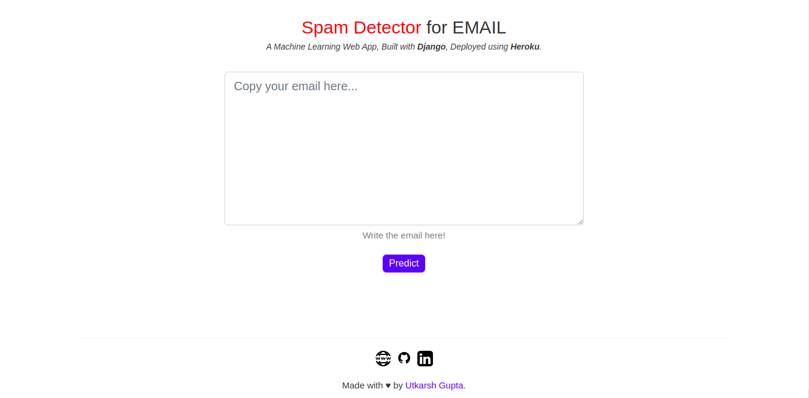

# :e-mail: Email Classifier

Email Classifier that classifies your email into :negative_squared_cross_mark: Spam or :white_check_mark: ham.

## Web App

Deployed by heroku at: http://spam-classifier-101.herokuapp.com/

## Gist

- Based on the concept of **Naive Bayes probability** method.
- The dataset used in the model is divided in 2 folders:- **ham** and **spam**.
- The link for the dataset is [**here.**](https://www.kaggle.com/veleon/ham-and-spam-dataset)
- The accuracy of the model : **97.217%**

## Tech Stack

- HTML, CSS
- Libraries
  - Numpy
  - Pandas
  - Scikit learn
  - Pickle
- Framework
  - Django
- Deploy
  - Heroku

## :arrow_forward: Run

- Clone this Repository: `git clone https://github.com/utkryuk/Spam-or-Not.git`
- `cd Spam-or-Not/`

    1. ### Train the Model

        - Run `python3 spam_classifier.py`
        - This saves the model using Pickle.

    2. ### Run the Web App
       - `cd webApp/spam_classifier/`
       - `pip3 install -r requirements.txt`
       - Now run, `python3 manage.py runserver`
       - If you see this: `Starting development server at http://127.0.0.1:8000/ Quit the server with CONTROL-C.`, you have done right till now.
       - Now, go to http://127.0.0.1:8000/ to view the email classifier.

## :camera: Screenshots

    

## Future Scope

- This could be made as a feature in any email service.

#### If you have any questions, just let me know [here.](mailto:utkryuk@gmail.com)

 
